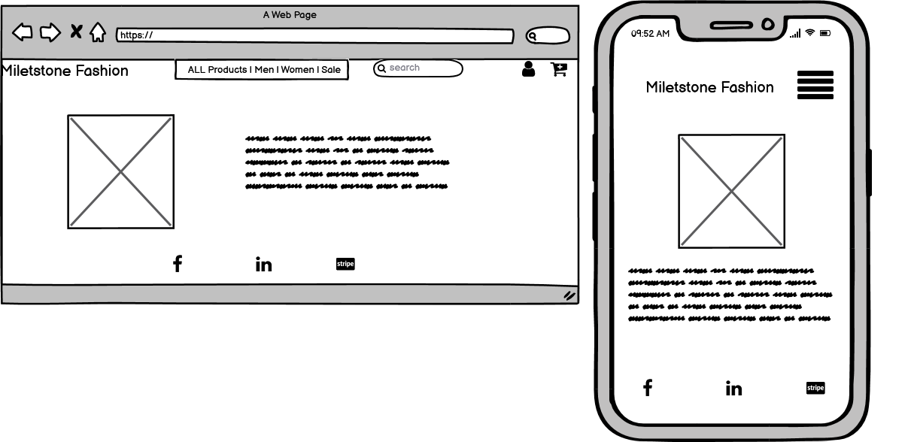
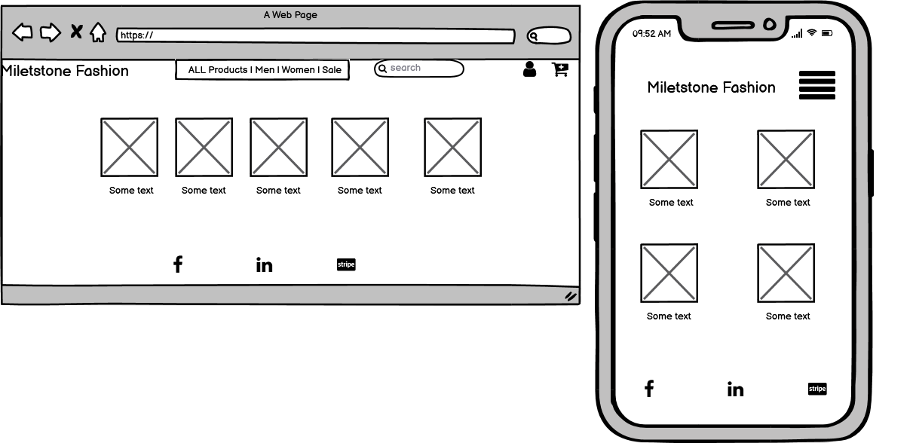
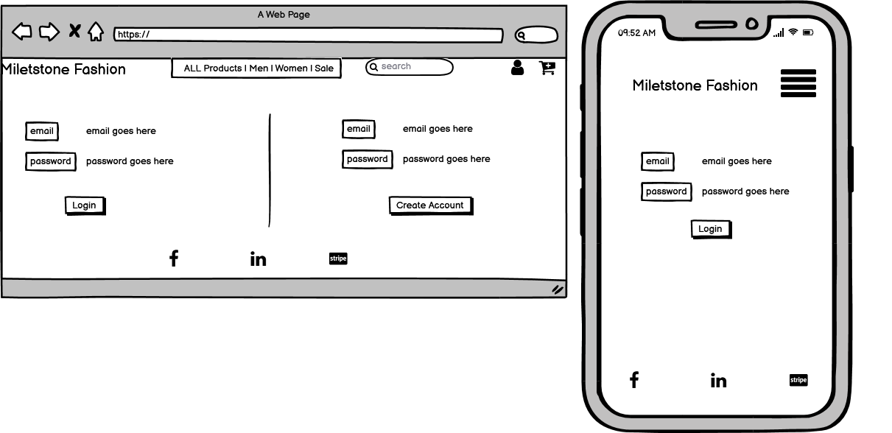

# Milestone Fashion

### [Live Site]()

Milestone Fashion is a fashion website where user can buy the latest clothes. The clothes advertised are not from know designers neither high end fashion clothes,
just a simple place where everyone can browse and just buy their favourite piece of clothe with no regret.

## Table of Contents:
-  [UX](#ux)
    -  [User Stories](#user-stories)
    -  [Strategy](#1-strategy)
    -  [Scope](#2-scope)
    -  [Structure](#3-structure)
    -  [Skeleton](#4-skeleton)
    -  [Surface](#5-surface)
-  [Features](#features)
    -  [Existing Features](#existing-features)
    -  [Features to consider implementing in the future](#features-to-consider-implementing-in-the-future)
-  [Technologies Used](#technologies-used)
    -  [Languages](#1-languages)
    -  [Integrations](#2-integrations)
    -  [Workspace, Version Control, and Repository Storage](#3-workspace-version-control-and-repository-storage)
-  [Resources](#resources)
-  [Testing](#testing)
-  [Deployment](#deployment)
-  [Credits](#credits)
-  [Acknowledgments](#acknowledgments)

## UX
### User Stories

- As a non-member, I want to visit the homepage to have an overview of what the site is about and the pricing page to check the prices.

- As a user, I want to easily understand the main purpose of the website so that I immediately know what the site is intended for upon entering.

- As a user, I want to be able to view the site on any device I may have, (mobile/tablet/desktop).

- As a user, I want to easily sign up to the website.

- As a user, I want to easily log in and log out on my account.

- As a user, I want to contact the website management to clarify doubts.

- As an admin/superuser, I want to recieve a confirmation email when a contact form is submitted.

- As an admin/superuser, I want to have the ability to update site content.

### 1. Strategy

The main strategy of this project is to promote the sale of clothing there will be a several category selection and the user can browse straight away to the category that he/she wished to make a purchase

####  Site Goals

- Provide an easy navigation website.

- Give a way to users easily chose clothing and checkout.

- Offer easy interaction on the page.

### 2. Scope

- Fits in with my current skill-set of HTML, CSS, JavaScript, Python and Django.

- Website information clearly relayed upon entering the home page.

- Easy way to Sign Up, Log in and Log out.

- Allow admin create, read, update and delete products.

### 3. Structure

The idea of the website is simple. Allow the user to buy a product and safely checkout.

The website has the same design to keep consistency and provide easy and friendly navigation to the user.

A clear communication is provided to the user after some interactions, using the messages function in Django.

### 4. Skeleton
-  Wireframes

    Homepage
    

    Product Category page
    

    Login
    

- Navigation bar - Menu with links pointing to each page
    - **Home** -
    - **Cart** -  Provide details of the purchase.
    - **Checkout** - Users can check a purchase summary and are invited to enter their delivery and payment details.
    - **Contact** - User can submit a form with their doubts and an email will be sent to the admin notifying about the request.